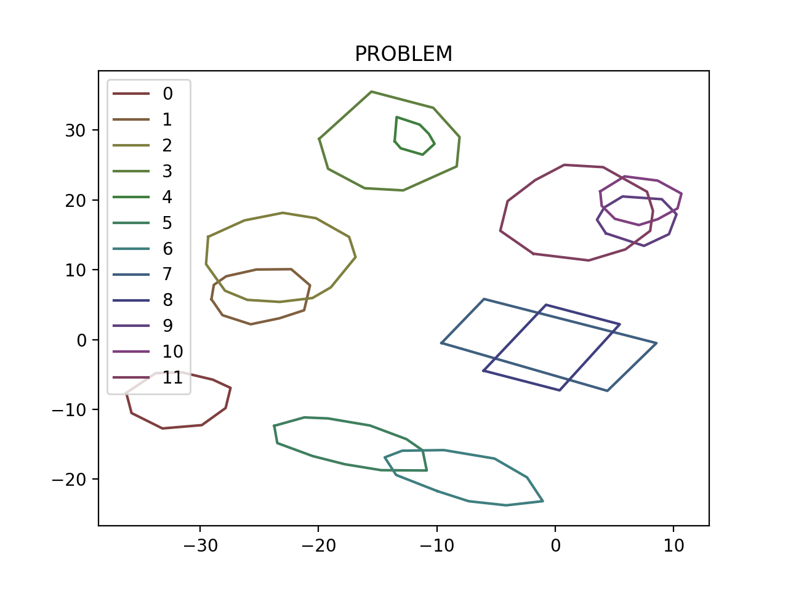
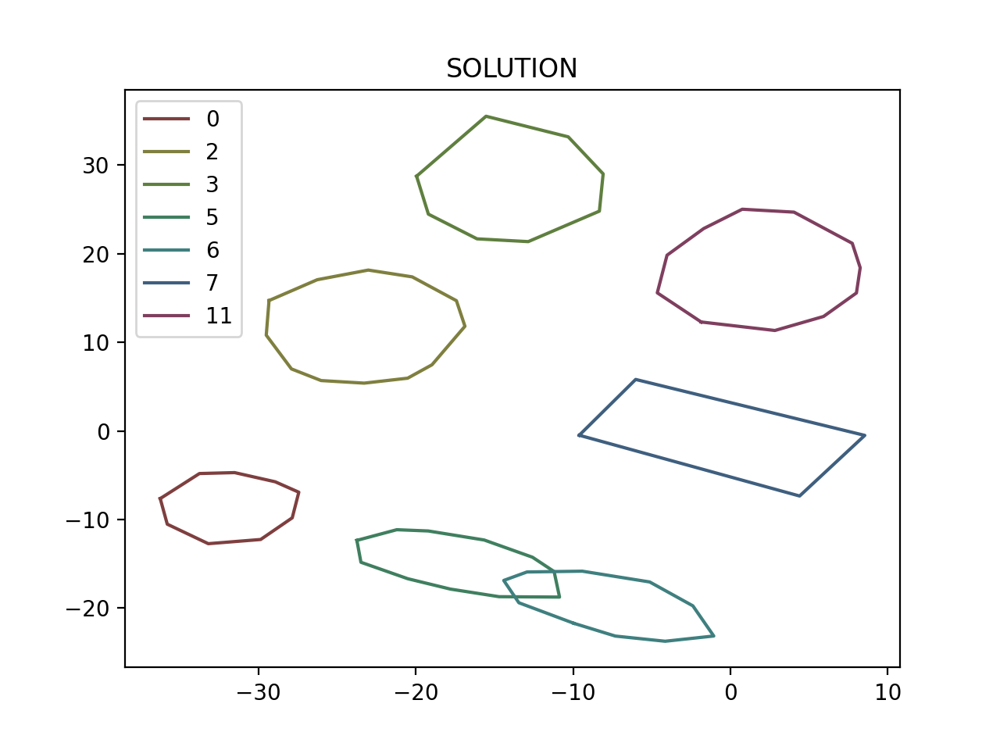

# CONVEX HULLS

> NOTE: This project follows the [C++ Core Guidelines](http://isocpp.github.io/CppCoreGuidelines/CppCoreGuidelines).

---

1. [Theory](#theory)
   1. [Pseudocode](#pseudocode)
2. [Class Hierarchy](#class-hierarchy)
3. [Directory Structure](#directory-structure)
4. [Compiling and Running](#compiling-and-running)
   1. [Visualization (optional)](#visualization-optional)
5. [Results](#results)

---

## Theory

### Pseudocode

``` psuedocode
for every combination of convex hulls:
    make a list of all apexes of either of the convex hull that lie inside the other;
        There are three categories of these points.
            1. Common apexes between the two convex hulls
            2. Those that lie on the edge of the other convex hull
            3. Those that lie properly inside the other convex hull
    add to this list, the intersection points of all the combinations between their edges;
```

---

## Class Hierarchy

* [`struct Point`](./include/geometry/point.h)  
* [`class Line`](./include/geometry/line.h)  
  * [`class Ray: Line`](./include/geometry/ray.h)  
    * [`class LineSegment: Ray`](./include/geometry/line_segment.h)  
* [`class Polygon`](./include/geometry/polygon.h)  

---

## Directory Structure

* [`bin/`](./bin) -- Binaries
* [`build/`](./build) -- Build files
* [`docs/`](./docs) -- Docs
* [`include/`](./include) -- Header files
* [`lib/`](./lib) -- Implementations
* [`src/`](./src) -- Application code
* [`tools/`](./tools) -- Complementary tools
* [`CMakeLists.txt`](./CMakeLists.txt)
* [`convex_hulls.json`](./convex_hulls.json) -- Input file
* [`result_convex_hulls.json`](./result_convex_hulls.json) -- Output file

---

## Compiling and Running

``` sh
PG_PROJECT_ROOT="<path/to/the/project/root>"
# or
cd <path/to/the/project/root>
PG_PROJECT_ROOT=$(pwd)
```

``` sh
cmake -S $PG_PROJECT_ROOT -B $PG_PROJECT_ROOT/build
```

``` sh
make -C $PG_PROJECT_ROOT/build && $PG_PROJECT_ROOT/bin/Convex_Hulls $PG_PROJECT_ROOT/convex_hulls.json
```

### Visualization (optional)

Convex Hulls listed in a JSON file can be visualized using the [*visualize.py*](./tools/visualize.py) Python script in the [*tools/*](./tools) directory.  

> Install requirements
>> *matplotlib*

``` sh
cd $PG_PROJECT_ROOT
pip install -r ./tools/requirements.txt
```

> Run script

``` sh
cd $PG_PROJECT_ROOT
python ./tools/visualize.py
```

---

## Results

> Input - [`convex_hulls.json`](./convex_hulls.json).  

> Output - [`result_convex_hulls.json`](./result_convex_hulls.json).  

